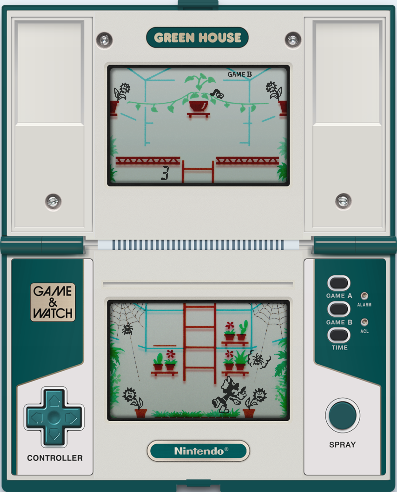

# Event-Driven Game & Watch

An opinionated event-driven implementation of few Nintendo Game &amp; Watch games

## Green House

Greenhouse (released as Green House) is a dual-screen Game & Watch game released as a part of ç
the Multi Screen series on December 6, 1982.

The player controls a bug exterminator referred to as only the "Fumigator" in the manual, 
and the objective is to spray worms and spiders that try to eat the flowers in a greenhouse. 
The worms crawl along vines on the top screen, while the spiders crawl along webs on 
the bottom screen, and the player will have to try to hit them with a bug spray before 
they reach the flowers. A ladder connects the two parts of the game 
(which otherwise offer almost identical action). 
The player receives a point for killing a worm far from a flower, 
two points for a worm one step away from a flower, and three points for a worm closest to a flower. 
To kill the spiders, however, the player needs to spray them closest to a flower. 
If sprayed farther away, the spiders back away one step, which gives the player a point. 
When the player kills a spider, they earn three points. As the game progresses, 
the worms and spiders will move faster. If a worm or spider reaches a flower, 
the flower will die, earning the player a miss. 
If the player gets 300 points without any misses, all points will be worth double until 
the player does get a miss. If the player has any misses at said score, all misses will be canceled instead. 
When the player gets three misses, they receive a Game Over.



### Topics

- Flower branch 1
- Flower branch 2
- Web 1
- Web 2

### Events

- Damage: A worm/spider try to damage a flower in the green house.
- Fumigate: Mr. Game tries to fumigate worms & spiders in the green house.

### Messages

- Worm: A worm comes to a branch closed to a flower.
- Spider: A spider is approaching to a flower

## How to test?

```
mvn clean test
```

## References

- https://en.wikipedia.org/wiki/Game_%26_Watch_series#Series
- https://en.wikipedia.org/wiki/List_of_Game_%26_Watch_games
- https://www.youtube.com/watch?v=CS-JGLZpSIU
